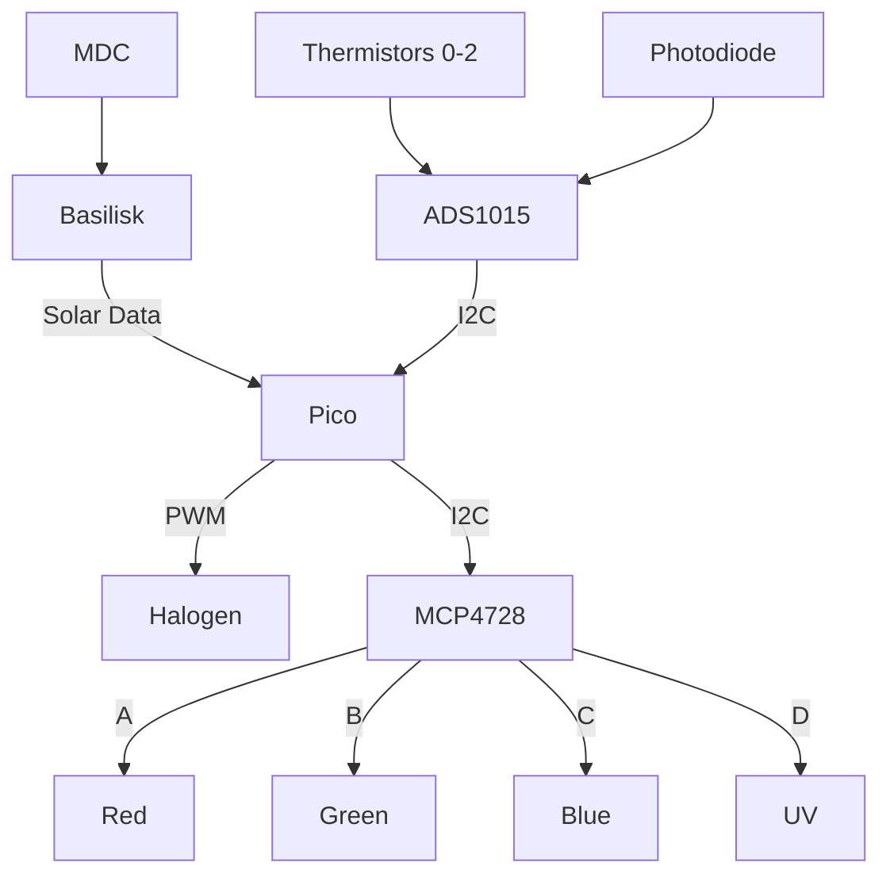

# oresat-solar-simulator-software

The software repository for our solar simulator for testing 1U solar panels [Hardware Repo](https://github.com/oresat/oresat-solar-simulator-hardware).

## Features

TODO: include feature list

## General Information

The OreSat Solar Simulator is a benchtop simulator for hardware-in-the-loop testing of CubeSat solar modules. It uses LED and halogen light bulbs to emit light that simulates the sun's solar spectrum in low Earth orbit (Air Mass 0 or 'AM0').

The original work for this was done as an MCECS Capstone Project from January to June of 2023 by Bendjy Faurestal, Adam Martinez, Cesar Ordaz-Coronel, and Charles Nasser. Andrew Greenberg was both representing PSAS as the Industry Sponsor and the Faculty Advisor to the students.

The continuation of this project is to convert the OreSat Solar Simulator Software from using the Beaglebone microcontroller to the Raspberry Pi Pico. The maintainers are OreSat engineers Charlene de la Paz, John Albert Abed, Angeline Vu, and Rose Edington with the assistance of Industry Advisor Jake Taylor.

## Planned Architecture
Hardware Stack

## Software

The software consists of a hub and client modules, both written in CircuitPython 8.2.10. The hub utilizes the [Basilisk Simulation Framework](http://hanspeterschaub.info/basilisk/) to determine which sides of the CubeSat would be exposed to light.

## Libraries

- [CircuitPython ulab](https://docs.circuitpython.org/en/latest/shared-bindings/ulab/index.html) - Numpy on a microcontroller
- [CircuitPython pwmio](https://docs.circuitpython.org/en/latest/shared-bindings/pwmio/index.html) - Controls the halogen bulb
- [Adafruit Python MCP4728](https://github.com/adafruit/Adafruit_CircuitPython_MCP4728) - Controls each of the LED light channels
- [Adafruit Python ADS1X15](https://github.com/Ayush2309/Adafruit_ADS) - Reads all of the onboard thermocouples and photodiode on the simulator

## Installation

TODO: include installation steps

## Usage

TODO: include usage

## License

All materials in this repo are copyright Portland State Aerospace Society and are licensed under the CERN Open Hardware Licence Version 2 - Strongly Reciprocal (CERN-OHL-S v2) and the GNU General Public License v3.0, or any later versions. A copy of the license is located [here](https://github.com/oresat/oresat-solar-simulator-software/blob/master/LICENSE.md).
