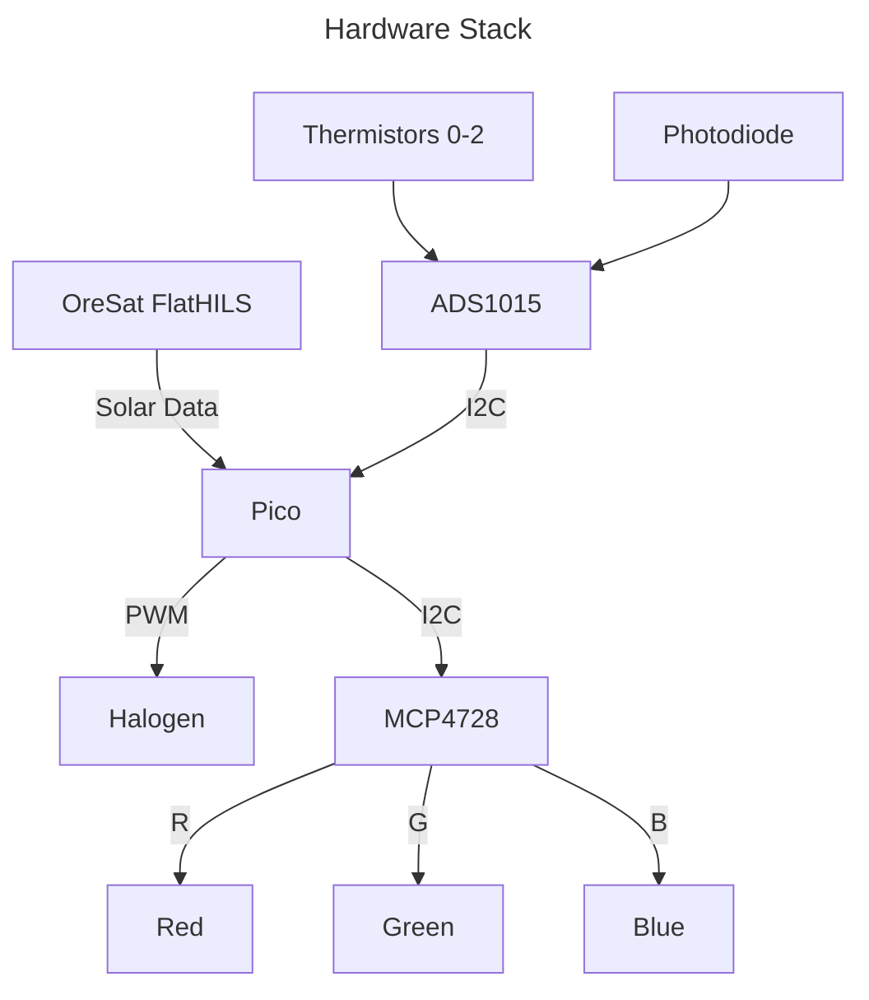

# OreSat Solar Simulator Software

The software that drives the PSAS Solar Simulator for testing OreSat's solar panels. See the [hardware repository](https://github.com/oresat/oresat-solar-simulator-hardware) for information related to the PSAS Solar Simulator hardware design and implementation.

## Overview

The OreSat Solar Simulator is a benchtop simulator for hardware-in-the-loop testing of CubeSat solar modules. It uses LED and halogen light bulbs to emit light that simulates the sun's solar spectrum in low Earth orbit (Air Mass 0 or 'AM0').

## Architecture


```mermaid
---
title: Hardware Stack
---

graph TD
    A[OreSat FlatHILS] -->|Solar Data| B[Pico]
    B -->|PWM| H[Halogen]
    C[ADS1015] -->|I2C| B
    B -->|I2C| F[MCP4728]
    T1[Thermistors 0-2] --> C
    PD[Photodiode] --> C
    F -->|R| R[Red]
    F -->|G| G[Green]
    F -->|B| L[Blue]
```

## Serial Protocol

The solar simulator is controlled over a single USB CDC serial connection (e.g. `/dev/ttyACM0`) at 115200 baud. The protocol is plain ASCII text, one message per line, and newline (`\n`) terminated. Every line is a self-contained request.

### Request

Send a single request containing an integer from 0 to 100 (the desired light intensity as a percentage of the simulator's peak output):

```
50
```

### Response

The solar simulator replies with exactly one line per request, in one of the following forms:

| Response | Meaning |
| --- | --- |
| `OK <intensity>` | The intensity was applied. `<intensity>` echoes the value that was set. |
| `ERR EMPTY no intensity value received` | An empty line was sent. |
| `ERR PARSE invalid intensity value received: <input>` | The line could not be parsed as an integer. |
| `ERR RANGE intensity value out of range: <input>` | The value parsed but was outside 0 to 100. |
| `ERR THERMAL <message>` | A thermistor could not be read. The lights are forced off. |
| `WARN THERMAL temperature too high, lights off for safety` | A shutdown threshold was hit (see Thermal Limits). The lights are switched off, the requested intensity is *not* applied, and the board blocks until it cools down before replying. |

### Thermal Limits

Every request also checks the onboard thermistors before it returns. If any reading is above its shutdown threshold, the lights are turned off and the board waits for all readings to fall back to the resume temperature before restoring the previous light levels:

| Thermistor | Shutdown Threshold |
| --- | --- |
| LED | 100°C |
| Heatsink | 60°C |
| Solar cell | 80°C |

Resume threshold (all three): 45°C.

### Known Limitations

- Only a single 0 to 100 intensity value can be set per request; there's no way to drive one light channel independently of the others.

### Example

```python
import serial

with serial.Serial("/dev/ttyACM0", baudrate=115200, timeout=1) as conn:
    conn.write(b"50\n")
    print(conn.readline().decode())  # OK 50
```

## Libraries

- [CircuitPython ulab](https://docs.circuitpython.org/en/latest/shared-bindings/ulab/index.html) - Numpy on a microcontroller
- [CircuitPython pwmio](https://docs.circuitpython.org/en/latest/shared-bindings/pwmio/index.html) - Controls the halogen bulb
- [Adafruit Python MCP4728](https://github.com/adafruit/Adafruit_CircuitPython_MCP4728) - Controls each of the LED light channels
- [Adafruit Python ADS1X15](https://github.com/Ayush2309/Adafruit_ADS) - Reads all of the onboard thermocouples and photodiode on the simulator

## Pre-Installation

Flashing the CircuitPython firmware onto the Raspberry Pi Pico is a well documented exercise.
See [CircuitPython for Raspberry Pi Pico](https://circuitpython.org/board/raspberry_pi_pico/) for the `.uf2` download,
and follow the instructions under "Learn how to install CircuitPython on this board" for detailed instructions.

## Installation

1.  Create and activate a virtual environment.

    > [!TIP]
    > Installing this software in a virtual environment for development and testing purposes is recommended, but not required.

2.  Install the project's primary and "dev" group dependencies.

    ```sh
    pip install --group dev -e .
    ```

## Build

1.  Cross-compile and build the distribution.

    ```sh
    make build
    ```

## Write

1.  Write to the Raspberry Pi Pico board attached via USB to your machine.

    ```sh
    make write
    ```

## Testing

This project uses [pytest](https://docs.pytest.org/en/stable/). To run the test suite, simply run:

```sh
pytest tests
```

## Acknowledgements

The original work for this was done as an MCECS Capstone Project from January to June of 2023 by Bendjy Faurestal,
Adam Martinez, Cesar Ordaz-Coronel, and Charles Nasser. Andrew Greenberg was both representing PSAS as the Industry
Sponsor and the Faculty Advisor to the students.

Work to convert the OreSat Solar Simulator Software from using the Beaglebone microcontroller to the Raspberry Pi Pico
was done by OreSat engineers Charlene de la Paz, John Albert Abed, Angeline Vu, and Rose Edington with the assistance of
Industry Advisor Jake Taylor.
