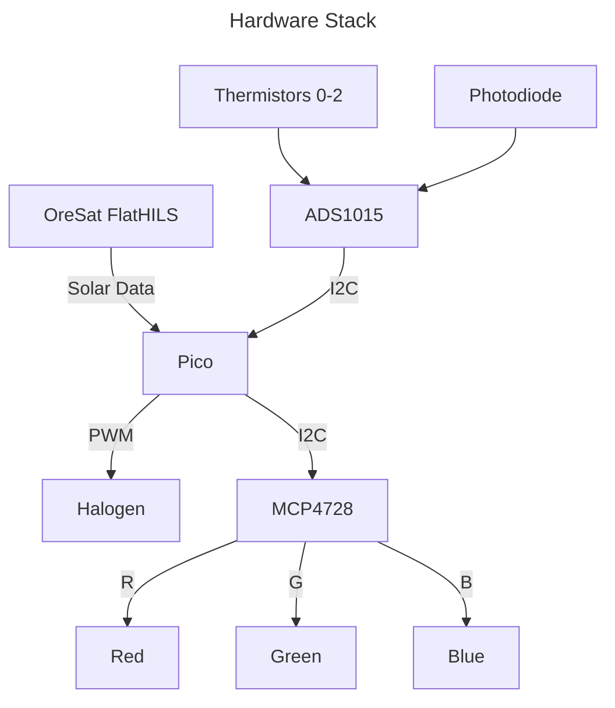

# OreSat Solar Simulator Software

The software that drives the PSAS Solar Simulator for testing OreSat's solar panels. See the [hardware repository](https://github.com/oresat/oresat-solar-simulator-hardware) for information related to the PSAS Solar Simulator hardware design and implementation.

## Overview

The OreSat Solar Simulator is a benchtop simulator for hardware-in-the-loop testing of CubeSat solar modules. It uses LED and halogen light bulbs to emit light that simulates the sun's solar spectrum in low Earth orbit (Air Mass 0 or 'AM0').

## Architecture


```mermaid
---
title: Hardware Stack
---

graph TD
    A[OreSat FlatHILS] -->|Solar Data| B[Pico]
    B -->|PWM| H[Halogen]
    C[ADS1015] -->|I2C| B
    B -->|I2C| F[MCP4728]
    T1[Thermistors 0-2] --> C
    PD[Photodiode] --> C
    F -->|R| R[Red]
    F -->|G| G[Green]
    F -->|B| L[Blue]
```

## Libraries

- [CircuitPython ulab](https://docs.circuitpython.org/en/latest/shared-bindings/ulab/index.html) - Numpy on a microcontroller
- [CircuitPython pwmio](https://docs.circuitpython.org/en/latest/shared-bindings/pwmio/index.html) - Controls the halogen bulb
- [Adafruit Python MCP4728](https://github.com/adafruit/Adafruit_CircuitPython_MCP4728) - Controls each of the LED light channels
- [Adafruit Python ADS1X15](https://github.com/Ayush2309/Adafruit_ADS) - Reads all of the onboard thermocouples and photodiode on the simulator

## Pre-Installation

Flashing the CircuitPython firmware onto the Raspberry Pi Pico is a well documented exercise.
See [CircuitPython for Raspberry Pi Pico](https://circuitpython.org/board/raspberry_pi_pico/) for the `.uf2` download,
and follow the instructions under "Learn how to install CircuitPython on this board" for detailed instructions.

## Installation

1.  Create and activate a virtual environment.

    > [!TIP]
    > Installing this software in a virtual environment for development and testing purposes is recommended, but not required.

2.  Install the project's primary and "dev" group dependencies.

    ```sh
    pip install --group dev -e .
    ```

## Build

The simulator has one build. It is unattended: it runs the Basilisk serial loop, driven by
OreSat's FlatHILS, and offers no interactive menu.

1.  Cross-compile and build the distribution.

    ```sh
    make build
    ```

### Headless protocol

The board is driven over the single USB console serial port. Send one intensity value per
line — a bare integer from 0 to 100, newline terminated.

```sh
printf '50\n' > /dev/ttyACM0
```

Every line is answered with exactly one response line, so a stray byte on the wire cannot
take down an unattended run.

| Response | Meaning |
| --- | --- |
| `OK <intensity> <reading>` | The value was applied. |
| `WARN THERMAL <intensity> <reading>` | The value is valid and is now the pending setpoint, held off while thermal shutdown is active. |
| `ERR <CODE> <description>` | The line could not be acted on. `CODE` is the token to branch on: `EMPTY`, `PARSE`, or `RANGE`. |

`OK` and `WARN` carry the thermal reading their answer was decided on, as
`led=<C> heatsink=<C> cell=<C>`:

```
OK 50 led=31.2 heatsink=28.4 cell=27.9
WARN THERMAL 50 led=104.7 heatsink=28.4 cell=27.9
```

The token is the state and the temperatures say how far that state is from changing, so a
host can tell a panel that is cooling from a board that has died. An `ERR` answers a line
that never reached the thermal check, and carries no reading.

#### Watchdog

If no line arrives for five seconds, the lamp is driven to zero and any setpoint held for a
cooling panel is dropped. This is the only mechanism that can safe the lamp once the host
is gone: a crashed or unplugged host cannot act, and the board checks temperature only when
a command arrives, so without it a lit lamp would hold its last setpoint unwatched.

The watchdog says nothing on the wire — every response answers a command, and a host that
has stopped sending is either gone or can see the gap on its own clock. The next line the
host sends rearms it.

To see a board respond, ramp one through its intensity range using the simple headless
smoke-test script.

```sh
python scripts/headless_smoke.py
```

## Write

1.  Write to the Raspberry Pi Pico board attached via USB to your machine.

    ```sh
    make write
    ```

## Testing

This project uses [pytest](https://docs.pytest.org/en/stable/). To run the test suite, simply run:

```sh
pytest
```

## Acknowledgements

The original work for this was done as an MCECS Capstone Project from January to June of 2023 by Bendjy Faurestal,
Adam Martinez, Cesar Ordaz-Coronel, and Charles Nasser. Andrew Greenberg was both representing PSAS as the Industry
Sponsor and the Faculty Advisor to the students.

Work to convert the OreSat Solar Simulator Software from using the Beaglebone microcontroller to the Raspberry Pi Pico
was done by OreSat engineers Charlene de la Paz, John Albert Abed, Angeline Vu, and Rose Edington with the assistance of
Industry Advisor Jake Taylor.
