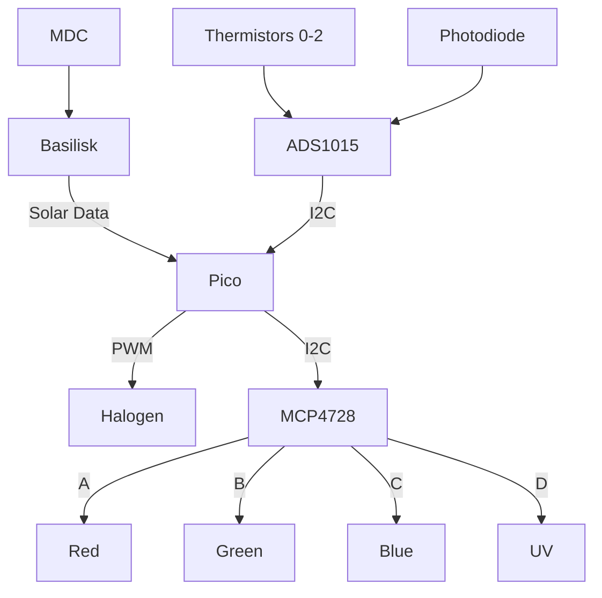

# oresat-solar-simulator-software

The software repository for our solar simulator for testing 1U solar panels [Hardware Repo](https://github.com/oresat/oresat-solar-simulator-hardware).

## Features

TODO: include feature list

## General Information

The OreSat Solar Simulator is a benchtop simulator for hardware-in-the-loop testing of CubeSat solar modules. It uses LED and halogen light bulbs to emit light that simulates the sun's solar spectrum in low Earth orbit (Air Mass 0 or 'AM0').

The original work for this was done as an MCECS Capstone Project from January to June of 2023 by Bendjy Faurestal, Adam Martinez, Cesar Ordaz-Coronel, and Charles Nasser. Andrew Greenberg was both representing PSAS as the Industry Sponsor and the Faculty Advisor to the students.

The continuation of this project is to convert the OreSat Solar Simulator Software from using the Beaglebone microcontroller to the Raspberry Pi Pico. The maintainers are OreSat engineers Charlene de la Paz, John Albert Abed, Angeline Vu, and Rose Edington with the assistance of Industry Advisor Jake Taylor.

## Planned Architecture
Hardware Stack

```mermaid
graph TD
    A[MDC] --> B[Basilisk]
    B -->|Solar Data| C[Pico]
    C -->|PWM| H[Halogen]
    E[ADS1015] -->|I2C| C
    C -->|I2C| F[MCP4728]
    T1[Thermistors 0-2] --> E
    PD[Photodiode] --> E
    F -->|A| R[Red]
    F -->|B| G[Green]
    F -->|C| L[Blue]
    F -->|D| UV[UV]
```

## Software

The software consists of a hub and client modules, both written in CircuitPython 8.2.10. The hub utilizes the [Basilisk Simulation Framework](http://hanspeterschaub.info/basilisk/) to determine which sides of the CubeSat would be exposed to light.

## Libraries

- [CircuitPython ulab](https://docs.circuitpython.org/en/latest/shared-bindings/ulab/index.html) - Numpy on a microcontroller
- [CircuitPython pwmio](https://docs.circuitpython.org/en/latest/shared-bindings/pwmio/index.html) - Controls the halogen bulb
- [Adafruit Python MCP4728](https://github.com/adafruit/Adafruit_CircuitPython_MCP4728) - Controls each of the LED light channels
- [Adafruit Python ADS1X15](https://github.com/Ayush2309/Adafruit_ADS) - Reads all of the onboard thermocouples and photodiode on the simulator

## Pre-Installation

1.  Follow the [official documentation steps](https://learn.adafruit.com/getting-started-with-raspberry-pi-pico-circuitpython/circuitpython) for flashing CircuitPython onto the Raspberry Pi Pico.

    > [!NOTE]
    > A CircuitPython firmware file (.uf2) can be found in the `firmware/` directory of this project. If a different firmware is used, kindly replace the firmware .uf2 file.

2.  Once the firmware has been flashed to the device, copy the `boot_out.txt` file from the device to the `firmware/` directory of this project. This file is needed for CI automation and development workflows that utilize the `make`.

    ```sh
    make fetch-boot-out
    ```

    > [!NOTE:]
    > If you do not follow this step, it will be run for you during the [Build and Deploy](#build-and-deploy) steps.

## Installation

1.  Create and activate a virtual environment.

    ```sh
    python -m venv .venv
    source .venv/bin/activate
    ```

2.  Install the project's dependencies.

    ```sh
    pip install -e ".[dev]"
    ```

## Build and Deploy

1.  Build and Deploy to the Raspberry Pi Pico board attached via USB to your machine.

    ```sh
    make deploy
    ```

## Usage

TODO: include usage

## Testing

Pytest is used as the test runner for this project. Run `pytest` on the command-line to run the test suite. For more information, see [Pytest's Official Documentation](https://docs.pytest.org/en/stable/).

## License

All materials in this repo are copyright Portland State Aerospace Society and are licensed under the CERN Open Hardware Licence Version 2 - Strongly Reciprocal (CERN-OHL-S v2) and the GNU General Public License v3.0, or any later versions. A copy of the license is located [here](https://github.com/oresat/oresat-solar-simulator-software/blob/master/LICENSE.md).
