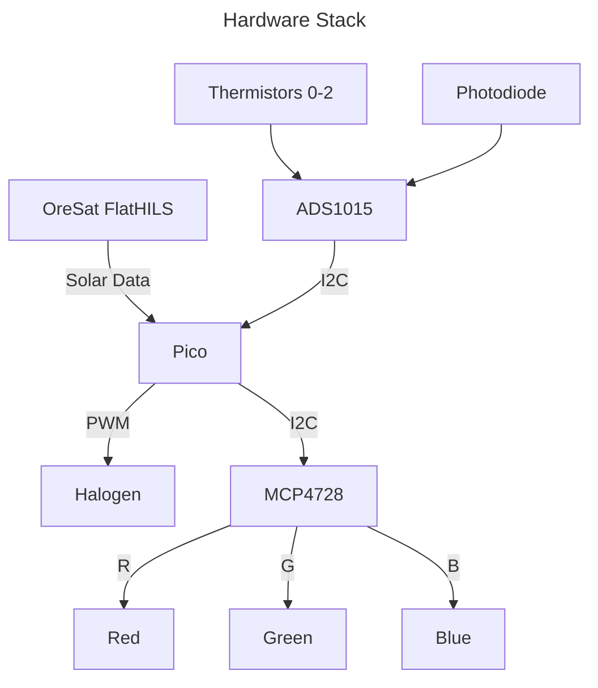

# OreSat Solar Simulator Software

The software that drives the PSAS Solar Simulator for testing OreSat's solar panels. See the [hardware repository](https://github.com/oresat/oresat-solar-simulator-hardware) for information related to the PSAS Solar Simulator hardware design and implementation.

## Overview

The OreSat Solar Simulator is a benchtop simulator for hardware-in-the-loop testing of CubeSat solar modules. It uses LED and halogen light bulbs to emit light that simulates the sun's solar spectrum in low Earth orbit (Air Mass 0 or 'AM0').

## Architecture


```mermaid
---
title: Hardware Stack
---

graph TD
    A[OreSat FlatHILS] -->|Solar Data| B[Pico]
    B -->|PWM| H[Halogen]
    C[ADS1015] -->|I2C| B
    B -->|I2C| F[MCP4728]
    T1[Thermistors 0-2] --> C
    PD[Photodiode] --> C
    F -->|R| R[Red]
    F -->|G| G[Green]
    F -->|B| L[Blue]
```

## Libraries

- [CircuitPython ulab](https://docs.circuitpython.org/en/latest/shared-bindings/ulab/index.html) - Numpy on a microcontroller
- [CircuitPython pwmio](https://docs.circuitpython.org/en/latest/shared-bindings/pwmio/index.html) - Controls the halogen bulb
- [Adafruit Python MCP4728](https://github.com/adafruit/Adafruit_CircuitPython_MCP4728) - Controls each of the LED light channels
- [Adafruit Python ADS1X15](https://github.com/Ayush2309/Adafruit_ADS) - Reads all of the onboard thermocouples and photodiode on the simulator

## Pre-Installation

Flashing the CircuitPython firmware onto the Raspberry Pi Pico is a well documented exercise.
See [CircuitPython for Raspberry Pi Pico](https://circuitpython.org/board/raspberry_pi_pico/) for the `.uf2` download,
and follow the instructions under "Learn how to install CircuitPython on this board" for detailed instructions.

## Installation

1.  Create and activate a virtual environment.

    > [!TIP]
    > Installing this software in a virtual environment for development and testing purposes is recommended, but not required.

2.  Install the project's primary and "dev" group dependencies.

    ```sh
    pip install --group dev -e .
    ```

## Build

1.  Cross-compile and build the distribution.

    ```sh
    make build
    ```

## Write

1.  Write to the Raspberry Pi Pico board attached via USB to your machine.

    ```sh
    make write
    ```

## Acknowledgements

The original work for this was done as an MCECS Capstone Project from January to June of 2023 by Bendjy Faurestal,
Adam Martinez, Cesar Ordaz-Coronel, and Charles Nasser. Andrew Greenberg was both representing PSAS as the Industry
Sponsor and the Faculty Advisor to the students.

Work to convert the OreSat Solar Simulator Software from using the Beaglebone microcontroller to the Raspberry Pi Pico
was done by OreSat engineers Charlene de la Paz, John Albert Abed, Angeline Vu, and Rose Edington with the assistance of
Industry Advisor Jake Taylor.
